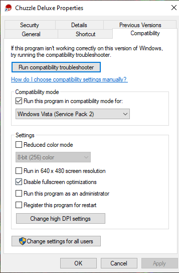

# Chuzzle Deluxe

## Running Chuzzle Deluxe
Generally Chuzzle will run with the following compatibility settings applied:


## Safe Mode Issues
Once Chuzzle is running, you'll likely find that it is running in a predetermined "safe mode", where the screen behind the "Play" button is mostly black, and the screen is set to low quality with 3D acceleration disabled. In order to get this working, follow these steps:
1.  With the game running in safe mode, create a user, and note the name for later (e.g. John)
1. Now go to the following location on your machine (Where C is the drive letter for your Windows installation):
    ```
    C:\ProgramData\PopCap Games\Chuzzle\Profiles
    ```
1. open the ```config.cfg``` file using a text editor (notepad will do) and ensure that your file looks similar to the included [config file](./config.cfg) in this repo. pay close attention to the ```DX::*``` settings, the ```Profiles``` setting, and the ```CurrentProfile``` setting. These last 2 should be the username you noted before
1. Now go to the following location on your machine (again using C as a Windows installation drive):
    ```
    C:\ProgramData\PopCap Games\Chuzzle\HardwareTestResults
    ```
1. In this folder should be a file called ```Hardware.registry```. Open this file using a text editor
1. The contents of this file are supposed to outline why the game launched in Safe Mode, and in most testing will say something generic like "Texture Switching Failed". Usually this can be ignored. Ensure that the following parameters are set to ```false```. an example file [here](./Hardware.registry) can be used as reference if required.
    - ```HWTEST::CardChanged```
    - ```HWTEST::DXVersionChanged```
    - ```HWTEST::SafeModeRequired```
1. Now run the game. This should allow you to run the game in 3D accelerated mode, without safe mode.